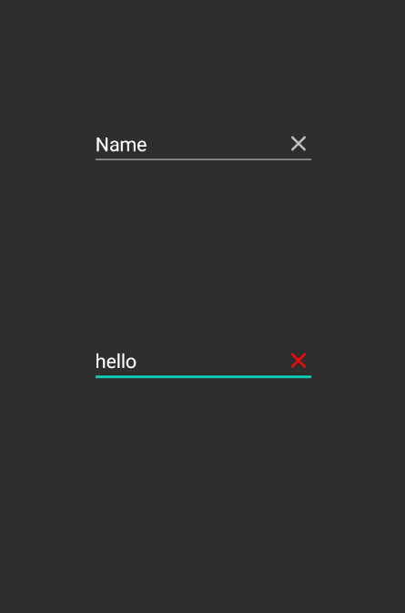

# EditTextClear

此项目为测试Maven上传项目Demo

带清空功能的EditText 支持删除图标的自定义

用法:
1.添加依赖

```
implementation 'com.wcdxg.edittextclear:editTextClear:1.0.0'
```

2.xml中使用 | 参数 | 说明 | | --- | --- | | clearIcon | 删除图标 |

```
 <com.wcdxg.edittextclear.EditTextWithClear
        android:id="@+id/editTextClear"
        style="@style/Widget.AppCompat.EditText"
        android:layout_width="wrap_content"
        android:layout_height="wrap_content"
        android:ems="10"
        android:hint="this is a custom EditText"
        android:inputType="textPersonName"
        app:clearIcon="@drawable/ic_baseline_clear_24_red"/>
```


